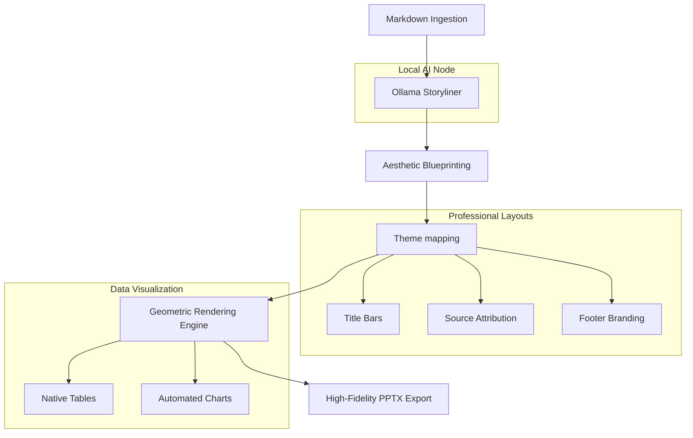

# 🎨 Spectral Weaver: Master of Agents

**Spectral Weaver** is a high-fidelity, privacy-first presentation engine that transforms Markdown documents into professional PowerPoint decks. powered by **Local AI** (Ollama), it automates storytelling, layout design, and data visualization without any cloud API costs or data privacy concerns.

---

## 🚀 Core Features

- **100% Local AI Pipeline**: Utilizes **Ollama (llama3:8b)** for intelligent content distillation and storyline generation.
- **Native Template Integration**: Dynamically maps content to your existing slide master's **Title Bars**, **Source Boxes**, and **Footers**.
- **Aesthetic Hardening**: Uses a geometric rendering engine with premium AI-generated assets, glassmorphism, and smooth transitions.
- **Data Intelligence**: Automated generation of native, theme-aware **Tables and Charts** directly from data-heavy markdown sections.
- **Industrial Preview**: A full Next.js dashboard to preview, tweak, and synchronize slide layouts before final export.

---

## 🏗️ Architectural Workflow



---

## 🛠️ Tech Stack

- **Backend**: FastAPI (Python 3.10+)
- **Frontend**: Next.js 15 (Turbopack)
- **AI Engine**: Ollama (llama3:8b)
- **Rendering**: python-pptx / spectral-weaver-core

---

## 📥 Setup & Installation

### Prerequisites
- [Ollama](https://ollama.com/) installed and running.
- Python 3.10 or higher.
- Node.js & npm.

### 1. Backend Setup
```bash
cd backend
pip install -r requirements.txt
# Ensure Ollama is running and pull the model:
ollama pull llama3:8b
# Start the API
python src/md2deck/api.py
```

### 2. Frontend Setup
```bash
cd frontend
npm install
npm run dev
```

---

## 📖 Usage
1. Open [http://localhost:3000](http://localhost:3000).
2. Choose one of the professional slide masters (Accenture, AI Bubble, UAE Solar).
3. Upload your Markdown file.
4. Preview the AI-distilled slides in the carousel.
5. Hit **Generate** to receive your production-ready `.pptx` file.

---

## 🛡️ License & Privacy
Spectral Weaver is designed for **privacy-first environments**. No content is ever sent to external cloud APIs; all distillation and rendering happen entirely on your local hardware.

---
*Created by the Mastering of Agents Team.*
