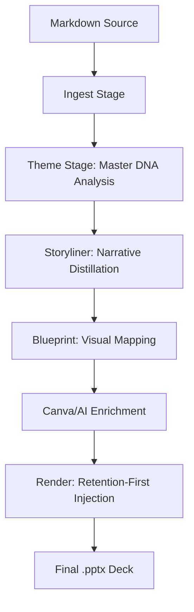

# 🌌 Spectral Weaver: Semantic Content Injection Engine

Spectral Weaver is a high-fidelity presentation engine designed to transform complex Markdown reports into premium, executive-grade PowerPoint decks. Unlike generic converters, Spectral Weaver uses a **Retention-First** strategy to preserve the brand identity and complex layouts of professional master templates while injecting content with semantic precision.

## ✨ System Architecture

Spectral Weaver operates as a multi-stage AI pipeline:



### 1. Ingest & DNA Analysis
- **Parser**: Strips TOC noise and redundant metadata.
- **DNA Extraction**: Analyzes the selected Master PPTX to identify existing slide content, layout slots, and brand palettes.

### 2. Narrative Arc (Gemini 1.5 Pro)
- Converts long-form reports into a 10-15 slide narrative.
- Maps content dynamically to the **Existing Template Slides** provided in the master file.

### 3. Retention-First Rendering
- **High-Fidelity Duplication**: Instead of rebuilding from scratch, the engine duplicates the original template slides.
- **Style Preservation**: Automatically captures font color, size, and weight from template placeholders to ensure injected text is visible and brand-compliant.
- **Dynamic Content**: Programmatically updates native PowerPoint Charts and Tables.
- **AI-Driven Visuals**: Replaces stock photos with contextual illustrations using the Pollinations.ai API.

---

## 🚀 Setup & Installation

### Backend (FastAPI)
1. **Navigate to backend**: `cd backend`
2. **Setup Environment**: Create a `.env` file with your keys:
   ```env
   GEMINI_API_KEY=your_key
   FREEPIK_API_KEY=your_key
   # Canva Oauth Keys for enterprise features
   ```
3. **Install Dependencies**: `pip install -e .`
4. **Run Server**: `uvicorn md2deck.api:app --reload`

### Frontend (Next.js)
1. **Navigate to frontend**: `cd frontend`
2. **Install Dependencies**: `npm install`
3. **Run App**: `npm run dev`

---

## ⏯️ Running a Generation

1. **Upload Markdown**: Select any `.md` file from the `Test Cases/` directory.
2. **Select Template**: Choose from the high-fidelity professional masters in the gallery.
3. **Preview & Edit**: Validate the AI-generated storyboard in the wizard before final rendering.
4. **Export**: Export to `backend/exports/` where the final PPTX and manifest are bundled.

---

## 🧠 Key Design Decisions

### Why "Retention-First"?
Generic rendering often results in "Blank White" slides that lose branding. Our engine uses the template itself as the donor, ensuring every logo, backdrop, and decorative shape is exactly where the designer intended.

### Semantic Mapping vs. Layout Matching
Instead of just picking a "Content" layout, our engine looks at the **actual data types** (tables, metrics, charts) and finds the corresponding template slide (Slide 3 might be a table, Slide 5 a chart). This produces a deck that feels custom-built by a human designer.

### Smart Logic Handling
- **Table Pruning**: If a template has 5 columns but the data has 3, the engine auto-wipes the surplus structure.
- **Z-Order Preservation**: Replaced images are inserted at the exact same depth as placeholders, preventing background layering issues.

---

## 📊 Benchmark Examples
- **Industry Insight**: `Test Cases/AI Bubble_ Detection, Prevention, and Investment Strategies.md`
- **Government Progress**: `Test Cases/UAE Progress toward 2050 Solar Energy Targets_20250729_120637.md`

Built for the **EZ Hackathon** | Master of Agents Workflow.
